本文内容编写时，参考了网上的资料，详见“参考资料”部分，感谢分享者。

# 1、引言

这个系列文章已经整理了10篇，但都没有涉及到具体的红包算法实现，主要有以下两方面原因。

一方面是各社交/IM产品中的红包功能同质化严重，红包算法的“可玩性”便是“核心竞争力所在”，这是同质化功能的差异化竞争思路，不会随便公开。

另一方面，市场上还存在各种抢红包插件这类灰产存在，一旦公开这些算法，很可能又被这帮插件开发者们搞出什么幺蛾子。

所以，这样的情况下，如果要做社交/IM产品中的红包功能，红包随便算法该怎么实现，基本上只能自已琢磨，很难找到大厂算法直接套用。

本着即时通讯网一贯的im知识传播精神，我收集整理并参考了大量的网上资料，综合了比较靠谱的信息来源，便有了本文。本文根据有限的资料，分享了微信红包随机算法实现中的一些技术要点，并整理了两种比较靠谱的红包算法实现思路（含可运行的实现代码），希望能给你的红包算法开发带来启发。

**申明：**本文资料整理自网络，仅供学习研究之用，如有不妥，请通知作者。

**学习交流：**

> **- 即时通讯开发交流5群：**[215477170](http://shang.qq.com/wpa/qunwpa%3Fidkey%3Db05cf91f7b0aa8f00159793feb080c75f4fe0778b5b5385c5b8485905a2d8a4a) [推荐]
>
> **- 移动端IM开发入门文章：**《[新手入门一篇就够：从零开发移动端IM](http://www.52im.net/thread-464-1-1.html)》
>
> **- 开源IM框架源码：**https://github.com/JackJiang2011/MobileIMSDK [推荐]

**本文已同步发布于“即时通讯技术圈”公众号，欢迎关注：**

▲ 本文在公众号上的链接是：[点此进入](https://mp.weixin.qq.com/s/UEhjfpTdhfuo9gWKkGolBQ)，原文链接是：http://www.52im.net/thread-3125-1-1.html

# 2、系列文章

- 《[社交软件红包技术解密(一)：全面解密QQ红包技术方案——架构、技术实现等](http://www.52im.net/thread-2202-1-1.html)》
- 《[社交软件红包技术解密(二)：解密微信摇一摇红包从0到1的技术演进](http://www.52im.net/thread-2519-1-1.html)》
- 《[社交软件红包技术解密(三)：微信摇一摇红包雨背后的技术细节](http://www.52im.net/thread-2533-1-1.html)》
- 《[社交软件红包技术解密(四)：微信红包系统是如何应对高并发的](http://www.52im.net/thread-2548-1-1.html)》
- 《[社交软件红包技术解密(五)：微信红包系统是如何实现高可用性的](http://www.52im.net/thread-2564-1-1.html)》
- 《[社交软件红包技术解密(六)：微信红包系统的存储层架构演进实践](http://www.52im.net/thread-2568-1-1.html)》
- 《[社交软件红包技术解密(七)：支付宝红包的海量高并发技术实践](http://www.52im.net/thread-2573-1-1.html)》
- 《[社交软件红包技术解密(八)：全面解密微博红包技术方案](http://www.52im.net/thread-2576-1-1.html)》
- 《[社交软件红包技术解密(九)：谈谈手Q春节红包的设计、容灾、运维、架构等](http://www.52im.net/thread-2583-1-1.html)》
- 《[社交软件红包技术解密(十)：手Q客户端针对2020年春节红包的技术实践](http://www.52im.net/thread-2966-1-1.html)》
- 《[社交软件红包技术解密(十一)：最全解密微信红包随机算法(含演示代码)](http://www.52im.net/thread-3125-1-1.html)》（* 本文）

# 3、微信红包算法要点汇总

这是目前能找到的仅有的一份，有微信团队人员参与的微信红包算法技术要点的讨论资料。分享于2015年，差不多是微信红包刚火没多久，大概是微信技术团队的人当时没有现在这些技术之外的顾虑，所以作了有限的分享，资料难得，本次重新整理了一下，可以作为参考资料使用。以下是资料正文。

**资料来源：**来自InfoQ的某架构群的技术讨论，由朱玉华整理（个人博客是：zhuyuhua.com（目前已无法访问））。

**资料背景：**起因是有朋友在朋友圈咨询微信红包的架构，于是在微信团队成员参与讨论的情况下，我（指“朱玉华”）整理了这次讨论的技术要点，也就是下面的内容（内容为问答形式）。

### 3.1、算法实现的技术要点

**问：微信的金额什么时候算？**

答：微信金额是拆的时候实时算出来，不是预先分配的，采用的是纯内存计算，不需要预算空间存储。

为什么采取实时计算金额？原因是：实时效率更高，预算才效率低下。预算还要占额外存储。因为红包只占一条记录而且有效期就几天，所以不需要多大空间。就算压力大时，水平扩展机器是。

**问：关于实时实时性，为什么明明抢到红包，点开后发现没有？**

答：2014年的红包一点开就知道金额，分两次操作，先抢到金额，然后再转账。

2015年的红包的拆和抢是分离的，需要点两次，因此会出现抢到红包了，但点开后告知红包已经被领完的状况。进入到第一个页面不代表抢到，只表示当时红包还有。

**问：关于分配算法，红包里的金额怎么算？为什么出现各个红包金额相差很大？**

答：随机，额度在 *0.01* 和剩余平均值 *2* 之间。 例如：发 *100* 块钱，总共 *10* 个红包，那么平均值是 *10* 块钱一个，那么发出来的红包的额度在 *0.01*元～*20*元之间波动。

当前面 *3* 个红包总共被领了 *40* 块钱时，剩下 *60* 块钱，总共 *7* 个红包，那么这 *7* 个红包的额度在：*0.01*～（*60/7 \* 2*）=*17.14*之间。

注意：这里的算法是每被抢一个后，剩下的会再次执行上面的这样的算法（Tim老师也觉得上述算法太复杂，不知基于什么样的考虑）。

这样算下去，会超过最开始的全部金额，因此到了最后面如果不够这么算，那么会采取如下算法：保证剩余用户能拿到最低1分钱即可。

如果前面的人手气不好，那么后面的余额越多，红包额度也就越多，因此实际概率一样的。

**问：红包的设计**

答：微信从财付通拉取金额数据过来，生成个数/红包类型/金额放到redis集群里，app端将红包ID的请求放入请求队列中，如果发现超过红包的个数，直接返回。根据红包的逻辑处理成功得到令牌请求，则由财付通进行一致性调用，通过像比特币一样，两边保存交易记录，交易后交给第三方服务审计，如果交易过程中出现不一致就强制回归。

**问：并发性处理：红包如何计算被抢完？**

答：cache会抵抗无效请求，将无效的请求过滤掉，实际进入到后台的量不大。cache记录红包个数，原子操作进行个数递减，到 0 表示被抢光。财付通按照 *20万笔*每秒入账准备，但实际还不到 *8万每秒*。

**问：通如何保持8w每秒的写入？**

答：多主sharding，水平扩展机器。

**问：数据容量多少？**

答：一个红包只占一条记录，有效期只有几天，因此不需要太多空间。

**问：查询红包分配，压力大不？**

答：抢到红包的人数和红包都在一条cache记录上，没有太大的查询压力。

**问：一个红包一个队列？**

答：没有队列，一个红包一条数据，数据上有一个计数器字段。

**问：有没有从数据上证明每个红包的概率是不是均等？**

答：不是绝对均等，就是一个简单的拍脑袋算法。

**问：拍脑袋算法，会不会出现两个最佳？**

答：会出现金额一样的，但是手气最佳只有一个，先抢到的那个最佳。

**问：每领一个红包就更新数据么？**

答：每抢到一个红包，就cas更新剩余金额和红包个数。

**问：红包如何入库入账？**

答：数据库会累加已经领取的个数与金额，插入一条领取记录。入账则是后台异步操作。

**问：入帐出错怎么办？比如红包个数没了，但余额还有？**

答：最后会有一个take all操作。另外还有一个对账来保障。

**问：既然在抢的时候有原子减了就不应该出现抢到了拆开没有的情况？**

答：这里的原子减并不是真正意义上的原子操作，是Cache层提供的CAS，通过比较版本号不断尝试。

**问：cache和db挂了怎么办？**

答：主备 +对账。

**问：为什么要分离抢和拆？**

答：总思路是设置多层过滤网，层层筛选，层层减少流量和压力。

这个设计最初是因为抢操作是业务层，拆是入账操作，一个操作太重了，而且中断率高。 从接口层面看，第一个接口纯缓存操作，搞压能力强，一个简单查询Cache挡住了绝大部分用户，做了第一道筛选，所以大部分人会看到已经抢完了的提示。

**问：抢到红包后再发红包或者提现，这里有什么策略吗？**

答：大额优先入账策略。

**针对上面的技术要点，有人还画了张原理图（这是网上能找到的相对清晰的版本）：** 

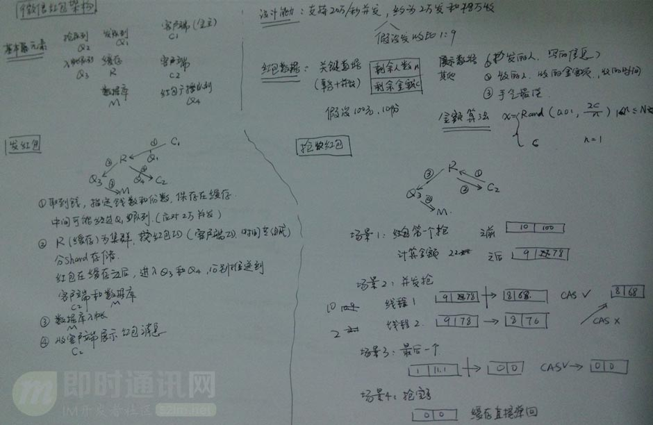

### 3.2、微信抢红包的过程模拟

针对上节中整理的资料，当有人在微信群里发了一个 N 人的红包、总金额 M 元，后台大概的技术逻辑如下。

***3.2.1）发红包后台操作：\***

- 1）在数据库中增加一条红包记录，存储到CKV，设置过期时间；
- 2）在Cache（可能是腾讯内部kv数据库，基于内存，有落地，有内核态网络处理模块，以内核模块形式提供服务））中增加一条记录，存储抢红包的人数N。

***3.2.2）抢红包后台操作：\***

- 1）抢红包分为抢和拆：抢操作在Cache层完成，通过原子减操作进行红包数递减，到0就说明抢光了，最终实际进入后台拆操作的量不大，通过操作的分离将无效请求直接挡在Cache层外面。
- 这里的原子减操作并不是真正意义上的原子减操作，是其Cache层提供的CAS，通过比较版本号不断尝试，存在一定程度上的冲突，冲突的用户会放行，让其进入下一步拆的操作，这也解释了为啥有用户抢到了拆开发现领完了的情况。
- 2）拆红包在数据库完成：通过数据库的事务操作累加已经领取的个数和金额，插入一条领取流水，入账为异步操作，这也解释了为啥在春节期间红包领取后在余额中看不到。
- 拆的时候会实时计算金额，其金额为1分到剩余平均值2倍之间随机数，一个总金额为M元的红包，最大的红包为 M * 2 /N（且不会超过M），当拆了红包后会更新剩余金额和个数。财付通按20万笔每秒入账准备，实际只到8万每秒。

# 4、微信红包算法模拟实现1（含代码）

根据上一节的微信红包随机算法技术要点资料，实现了一个算法，以下供参考。（注：本节内容引用自《[微信红包随机算法初探](https://www.jianshu.com/p/026ceece4d80)》一文）

### 4.1、算法约定

算法很简单，跟微信的算法一样，不是提前算好，而是抢红包时计算。

**即：**金额随机，额度在0.01和剩余平均值*2之间。（参见上一节的 “[关于分配算法，红包里的金额怎么算？为什么出现各个红包金额相差很大？](http://www.52im.net/thread-3125-1-1.html%234)” 内容）

### 4.2、代码实现

**算法的逻辑主要是：**

> public static double getRandomMoney(RedPackage _redPackage) {
>
>   // remainSize 剩余的红包数量
>
>   // remainMoney 剩余的钱
>
>   if(_redPackage.remainSize == 1) {
>
> ​    _redPackage.remainSize--;
>
> ​    return (double) Math.round(_redPackage.remainMoney * 100) / 100;
>
>   }
>
>   Random r   = newRandom();
>
>   double min  = 0.01; //
>
>   double max  = _redPackage.remainMoney / _redPackage.remainSize * 2;
>
>   double money = r.nextDouble() * max;
>
>   money = money <= min ? 0.01: money;
>
>   money = Math.floor(money * 100) / 100;
>
>   _redPackage.remainSize--;
>
>   _redPackage.remainMoney -= money;
>
>   return money;
>
> }

**LeftMoneyPackage数据结构如下：**

> class RedPackage {
>
>   int remainSize;
>
>   double remainMoney;
>
> }

**测试时初始化相关数据是：**

> static void init() {
>
>   redPackage.remainSize = 30;
>
>   redPackage.remainMoney = 500;
>
> }

附件是可以运行的完整Java代码文件：

（无法上传附件，如有需要请从此链接处下载：http://www.52im.net/thread-3125-1-1.html）

### 4.3、测试结果

#### 4.3.1 单次测试

**按上述代码中的初始化数据（30人抢500块），执行了两次，结果如下：**

> //第一次
>
> 15.69  21.18  24.11  30.85  0.74  20.85  2.96  13.43  11.12  24.87  1.86  19.62  5.97  29.33  3.05  26.94  18.69  34.47  9.4 29.83  5.17  24.67  17.09  29.96  6.77  5.79  0.34  23.89  40.44  0.92
>
> //第二次
>
> 10.44  18.01  17.01  21.07  11.87  4.78  30.14  32.05  16.68  20.34  12.94  27.98  9.31  17.97  12.93  28.75  12.1  12.77  7.54  10.87  4.16  25.36  26.89  5.73  11.59  23.91  17.77  15.85  23.42  9.77

**第一次随机红包数据图表如下：** 

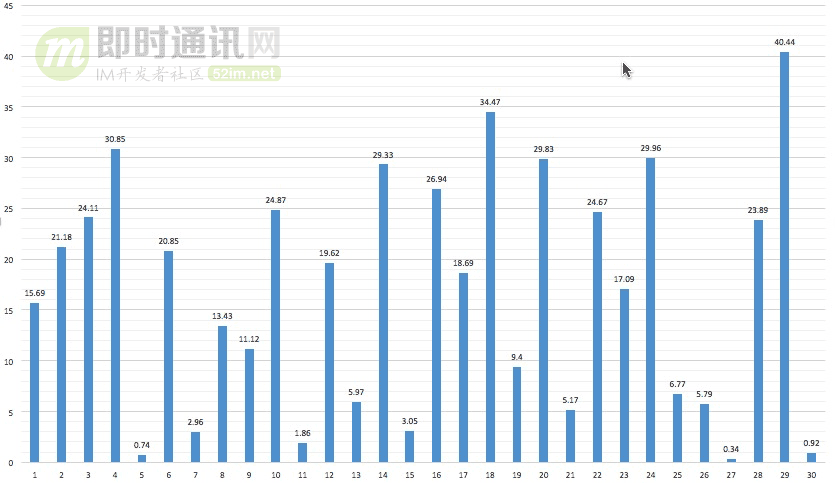

▲ x轴为抢的顺序，y轴为抢到的金额

**第二次随机红包数据图表如下：**

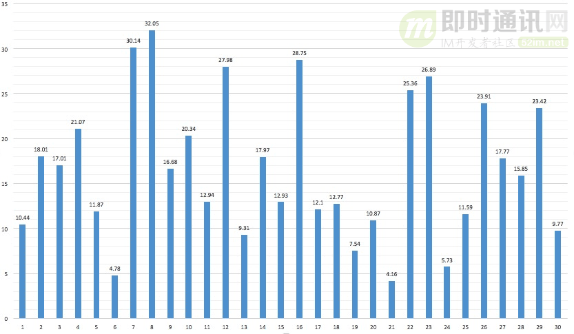

▲ x轴为抢的顺序，y轴为抢到的金额

#### 4.3.2 多次均值

**重复执行200次的均值：**

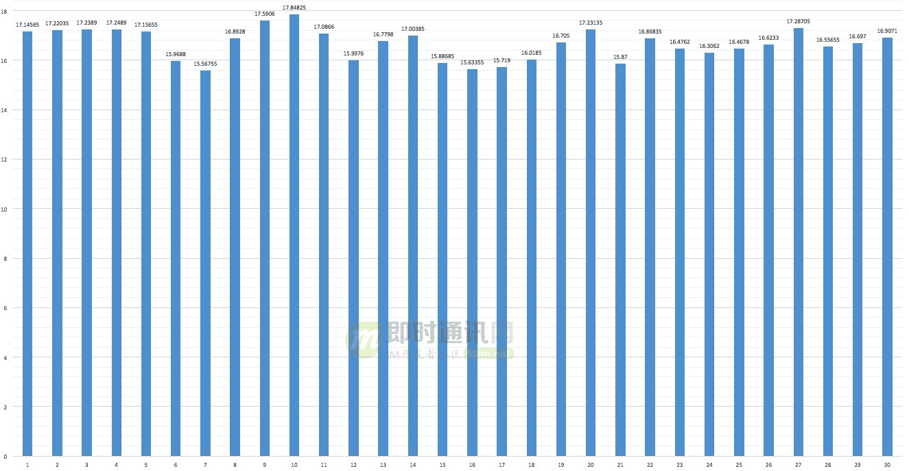

▲ x轴为抢的顺序，y轴为该次抢到金额的概率均值

**重复执行2000次的均值：** 

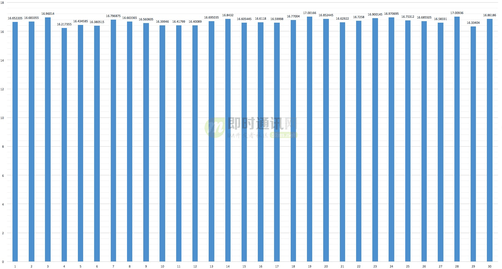

▲ x轴为抢的顺序，y轴为该次抢到金额的概率均值

从以上两张图的均值结果可以看出，这个算法中每一次能抢到的金额几率几乎是均等的，从随机性来说比较合理。

# 5、微信红包算法模拟实现2（含代码）

我对随机算法很感兴趣，正巧最近研究的方向有点偏随机数这块，所以也自己实现了一下微信的红包分发算法（算法要点参考的是本文第三节内容）。（注：本节内容引用自《[微信红包算法的分析](https://hacpai.com/article/1478364657122)》一文）

### 5.1、代码实现

从第三节中可以了解到，微信并不是一开始就预分配所有的红包金额，而是在拆时进行计算的。这样做的好处是效率高，实时性。本次的代码中，红包具体是怎么计算的呢？请参见第4节中的“[关于分配算法，红包里的金额怎么算？为什么出现各个红包金额相差很大？](http://www.52im.net/thread-3125-1-1.html%234)”。

**那基于这个思想，可以写出一个红包分配算法：**

> /**
>
>  \* 并不完美的红包算法
>
>  */
>
> public static double rand(double money, int people, List<Double> l) {
>
>   if(people == 1) {
>
> ​    double red = Math.round(money * 100) / 100.0;
>
> ​    l.add(red);
>
> ​    return0;
>
>   }
>
>   Random random = newRandom();
>
>   double min = 0.01;
>
>   double max = money / people * 2.0;
>
>   double red = random.nextDouble() * max;
>
>   red = red <= min ? min : red;
>
>   red = Math.floor(red * 100) / 100.0;
>
>   l.add(red);
>
>   double remain = Math.round((money - red) * 100) / 100.0;
>
>   return remain;
>
> }

算法整体思路很简单，就在在最后一个人的时候要注意，此时不进行随机数计算，而是直接将剩余金额作为红包。

### 5.2、第一次分析

采用上述算法，可以对用户的抢红包行为做分析。**这里的模仿行为是：**30 元的红包，10 人抢。操作 100 次。

**可以得出如下结果：** 

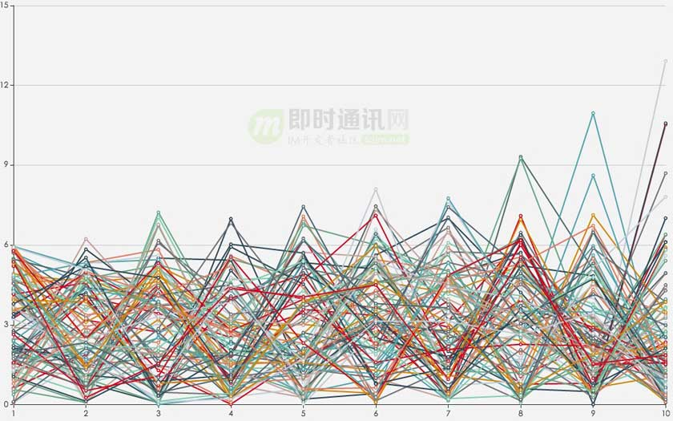

▲ x轴为抢的顺序，y轴为该次抢到金额

从上图中可以很轻易的看出来，越后抢的人，风险越大，同时收益也越大，有较大几率获得“手气最佳”。

**那红包面值的分布性如何呢？**

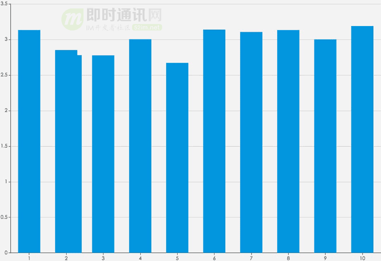

▲ x轴为抢的顺序，y轴为该次抢到金额重复 100 次后的平均值

从上图可以看出，都是比较接近平均值(3 元)的。

**那重复 1000 次呢？**

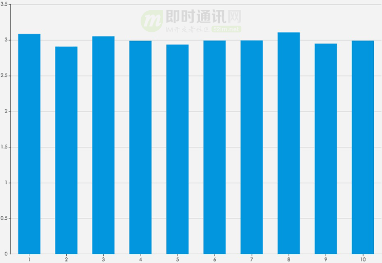

▲ x轴为抢的顺序，y轴为该次抢到金额重复 1000 次后的平均值

更接近了。。。

可以看出，这个算法可以让大家抢到红包面额在概率上是大致均等的。

### 5.3、不足之处

**有人提出了这个问题：** 

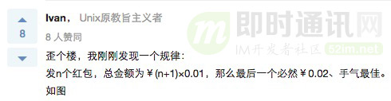

他接下来放了好几张他试验的截图。我这里取了一张，如果有兴趣，可以去[知乎的问题](https://www.zhihu.com/question/22625187%3Futm_source%3D52im.net)里查看更多图片。

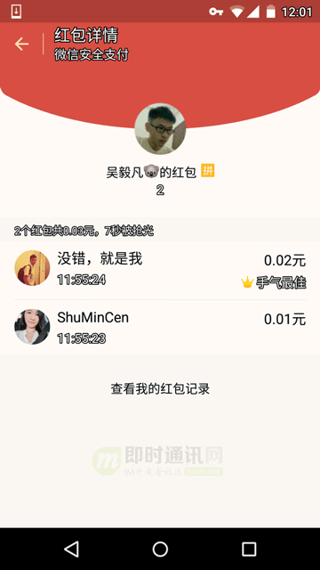

而此时，我哥们在和我的在讨论中，也告诉我，确实存在某个规律，可能让最后一个抢的人占有某些微小的优势，比如，多 0.01 的之类。

例如发 6 个，总额 0.09 的包，最后一个抢的有极大概率是 0.03。

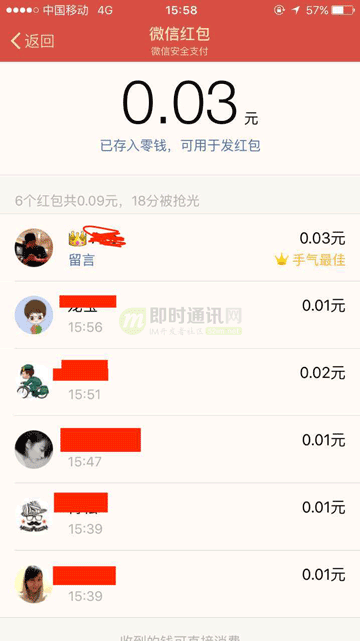

然而我之前的代码却没办法体现出这一点。

**比如 10 人拆 0.11 元的包，我的结果是：**

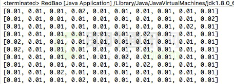

可见以上代码还存在不足之处。

**于是我就有一个猜测：**

> 微信可能不是对全金额进行随机的，可能在派发红包之前，已经对金额做了处理，比如，事先减去(红包个数*0.01)，之后在每个红包的随机值基础上加 0.01，以此来保证每个红包最小值都是 0.01。

这个猜测或许可以解开那位知友和我哥们这边的疑惑。

### 5.4、完善算法

**在原先的基础上对代码进行简单的修正：**

> public static double rand(double money, int people, List<Double> l) {
>
>   if(people == 1) {
>
> ​    double red = Math.round(money * 100) / 100.0;
>
> ​    l.add(red+0.01);
>
> ​    return 0;
>
>   }
>
>   Random random = newRandom();
>
>   double min = 0;
>
>   double max = money / people * 2.0;
>
>   double red = random.nextDouble() * max;
>
>   red = red <= min ? min : red;
>
>   red = Math.floor(red * 100) / 100.0;
>
>   l.add(red+0.01);
>
>   double remain = Math.round((money - red) * 100) / 100.0;
>
>   return remain;
>
> }

**这个算法，在第一次调用时传入 money 的值是总金额减去红包数\*0.01，大概像这样：**

> _money = _money - people * 0.01;

### 5.5、第二次分析

#### 5.5.1 验证上次的不足之处

**1）10 人抢 0.11 元的包：**

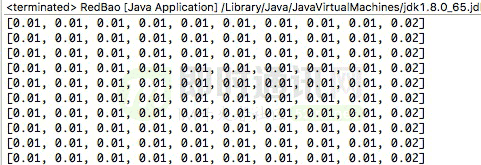

**2）2 人抢 0.03 元的包：** 

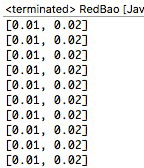

**3）6 人抢 0.09 的包：**

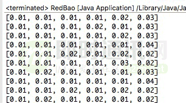

#### 5.5.2 修改后的代码会不会对已知结论造成影响？

30 元的红包，10 人抢，操作 100 次。

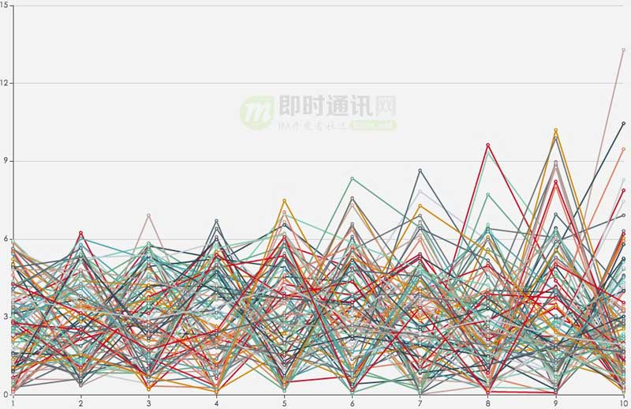

▲ x轴为抢的顺序，y轴为该次抢到金额 

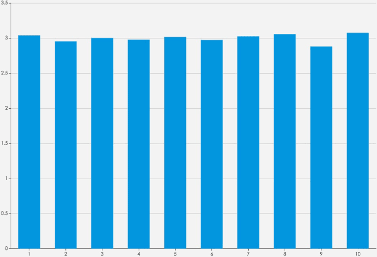

▲ x轴为抢的顺序，y轴为该次抢到金额重复 100 次后的平均值

由上面两图可见，结论基本上没有改变。

### 5.6、结论

经过上述代码实践可知：

> 1）先抢后抢，金额期望都是相同的；
>
> 2）微信的红包算法很可能是预先分配给每人 0.01 的“底额”；
>
> 3）后抢者风险高，收益大。

### 5.7、补充

上几张后面测试的图，补充一下之前的观点，发 n 个红包，总金额是(n+1)*0.01，最后一个领的一定是手气最佳。

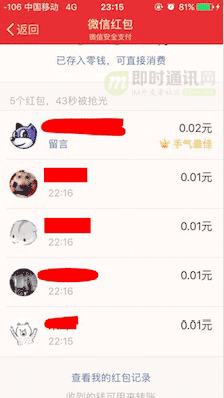

 

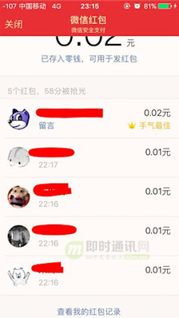

大家也可以试试。

以上，大概可以证明，微信红包是在分配前先给每个人 0.01 的最低金额的！

# 6、参考资料

> [1] [微信红包随机算法初探](https://www.jianshu.com/p/026ceece4d80)
>
> [2] [微信红包算法的分析](https://hacpai.com/article/1478364657122)
>
> [3] [微信红包的架构设计简介](https://www.zybuluo.com/yulin718/note/93148)
>
> [4] [微信红包的随机算法是怎样实现的？](https://www.zhihu.com/question/22625187%3Futm_source%3D52im.net)

另外，知乎上对于微信红包算法的讨论问题很多人参与，有兴趣可以上去看看，或许会有更多启发：《[微信红包的随机算法是怎样实现的？](https://www.zhihu.com/question/22625187%3Futm_source%3D52im.net)》。