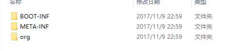
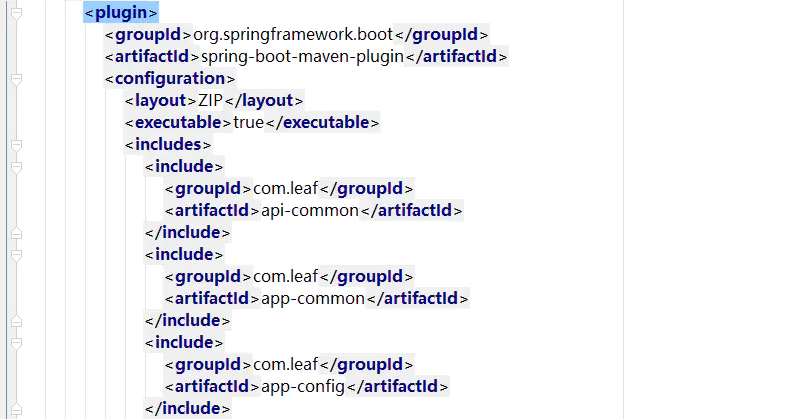
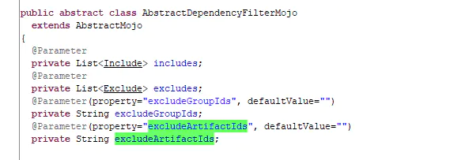
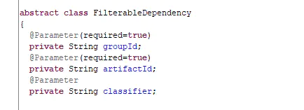
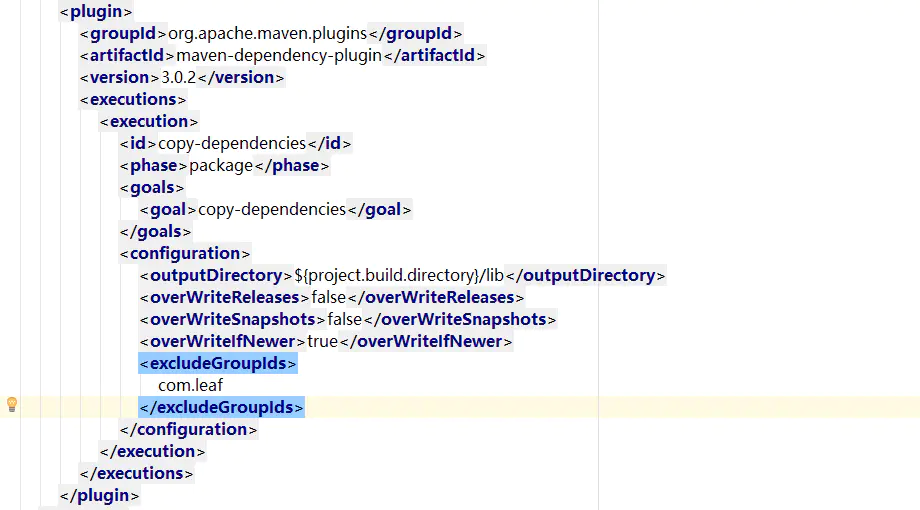

# springboot项目依赖包外置运行

[lwz9103](https://www.jianshu.com/u/5031681b3674)关注

2017.11.10 16:42:17字数 440阅读 4,370

### 问题背景

使用spring-cloud之后，网关、注册中心、配置中心加上自己的应用，包总共大小达到了200+M（大部分是spring-framework和apache依赖）。jenkins构建好应用后，需要scp到其他环境上去，由于办的阿里云ECS主机带宽只有2M，所以每次都要花10min+复制这些应用程序。

如果碰到个bug要修复。代码提交到git，jenkins构建，部署到测试环境，这一整套下来至少要20min，其中大部分时间都是花在scp jar包上了。而这些jar包改动的地方很小，第三方依赖基本不怎么变，所以就想着把这些第三方依赖包挪到外部，通过启动参数加载这些依赖。

### 解决思路

##### 1.设置springboot在打包时只包含我们自己项目的代码

解压maven打好的jar包，我们可以发现内部有个 /BOOT-INF/lib。

image.png

这个是springboot-maven-plugin在执行 repackage goal时做的。我们可以通过配置plugin的configuration来指定我们想要include和exclude的jar包。（很奇怪的是，有excludeGroupIds，却没有includeGroupIds）。查看官网（[https://docs.spring.io/spring-boot/docs/current/maven-plugin/repackage-mojo.html](https://link.jianshu.com/?t=https://docs.spring.io/spring-boot/docs/current/maven-plugin/repackage-mojo.html)），可以这么做在打包时只保留我们自己的项目：

image.png

好奇心驱使，查看了下springboot-maven-plugin源码，可以知道configuration支持的标签为includes,excludes,excludeGroupIds和excludeArtifactIds。其中includes有子标签include,include（Include继承了FilterableDependency）的属性有三个。

image.png

image.png

##### 2.导出剩下的不在jar中的依赖（貌似springboot-maven-plugin没有提供这个功能）

apache-maven-dependency-plugin提供了这么一个功能让我们在打包项目的时候，将这些依赖项导出（官方文档地址：[http://maven.apache.org/plugins/maven-dependency-plugin/sources-mojo.html](https://link.jianshu.com/?t=http://maven.apache.org/plugins/maven-dependency-plugin/sources-mojo.html)）。配置如下：

image.png

导出后，将这些依赖固定放到主机的某个目录下，以后这部分依赖基本就不用更新了

##### 3.启动springboot项目时，指定lib目录

JAVA_OPTION中携带`-Dloader.path=/opt/leaf/dependency/app-api-getway/lib`即可

### 结果

排除了第三方依赖后，自己项目打出来的包仅有2M+，复制到远程主机1min不到就搞定了。这样在修改完bug后测试，几分钟就能看到效果了。