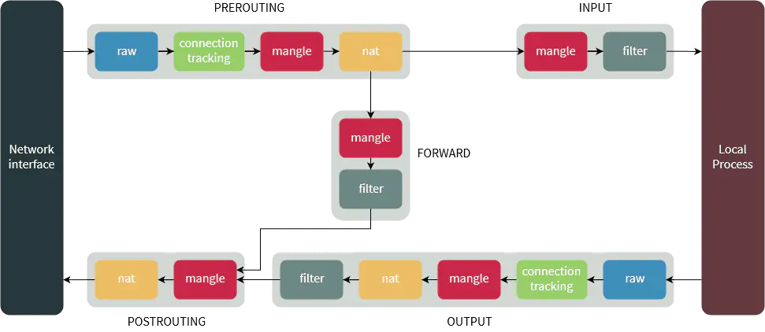

# 透明代理 UDP 为什么要用 TProxy？

[](https://www.jianshu.com/u/6f06de5a77bd)

[闲云野马](https://www.jianshu.com/u/6f06de5a77bd)关注

0.2282019.11.17 00:50:19字数 1,166阅读 1,910

假设你在路由器上搭建透明代理，要将局域网发过来的 UDP 流量（不包括路由器本身发出的流量）转发到透明代理，你需要执行以下这些命令：


```bash
ip rule add fwmark 1 lookup 100
ip route add local default dev lo table 100
iptables -t mangle -I PREROUTING -p udp --dport 53 -j TPROXY --on-port 1090 --tproxy-mark 0x01/0x01
iptables -t mangle -I OUTPUT -p udp --dport 53 -j MARK --set-mark 1
# 透明代理端口为 1090，假设只转发 53 端口的 DNS 查询流量
```

如果你要转发的流量是 TCP，那你只需要执行一条命令就可以了：


```bash
iptables -t nat -A PREROUTING -p tcp --dport 80 -j REDIRECT --to-port 1090
# 假设只转发 80 端口的流量
```

为什么转发 UDP 不能像转发 TCP 那样配置？

先来看一个问题。转发 TCP 时，REDIRECT 后包的目的地址已经变了，理论上来说，原目的地址已经丢了，透明代理是拿不到原目的地址的。那为什么透明代理能正确转发包呢？

实际上 netfilter 框架（iptables 也是基于这个框架暴露的勾子开发的）有 SO_ORIGINAL_DST 选项可以支持拿到原目的地址，netfilter 会将包的原目的地址放在 socket 的 SO_ORIGINAL_DST 属性里。

那么为什么 TCP 可以通过 SO_ORIGINAL_DST 拿到原目的地址，UDP 却不行？

原因跟 netfilter 的实现有关，SO_ORIGINAL_DST 是在 socket 上实现的，当 TCP 建立连接后，从对端的 socket 上就能拿到这个连接的原目的地址，实现成本很低。


```c
int main() 
{ 
    int sockfd, connfd, len; 
    struct sockaddr_in servaddr, cli; 
  
    sockfd = socket(AF_INET, SOCK_STREAM, 0); 

    bzero(&servaddr, sizeof(servaddr)); 
  
    servaddr.sin_family = AF_INET; 
    servaddr.sin_addr.s_addr = htonl(INADDR_ANY); 
    servaddr.sin_port = htons(PORT); 
  
    bind(sockfd, (SA*)&servaddr, sizeof(servaddr));
  
    listen(sockfd, 5);

    len = sizeof(cli); 
    connfd = accept(sockfd, (SA*)&cli, &len); 
  
    // 从 connfd 就能拿到该连接的原目的地址
    // getsockopt(connfd, SOL_IP, SO_ORIGINAL_DST, destaddr, &socklen);
  
    close(sockfd); 
} 
```

而 UDP 不是面向连接的，无法从 socket 里去拿原目的地址：


```c
int main() { 
    int sockfd; 
    char buffer[MAXLINE]; 
    char *hello = "Hello from server"; 
    struct sockaddr_in servaddr, cliaddr; 
    
    sockfd = socket(AF_INET, SOCK_DGRAM, 0);
      
    memset(&servaddr, 0, sizeof(servaddr)); 
    memset(&cliaddr, 0, sizeof(cliaddr)); 
    
    servaddr.sin_family    = AF_INET; // IPv4 
    servaddr.sin_addr.s_addr = INADDR_ANY; 
    servaddr.sin_port = htons(PORT); 
      
    bind(sockfd, (const struct sockaddr *)&servaddr,  sizeof(servaddr));
      
    int len, n; 
    n = recvfrom(sockfd, (char *)buffer, MAXLINE,  
                MSG_WAITALL, ( struct sockaddr *) &cliaddr, 
                &len); 
    buffer[n] = '\0'; 

    // 由于 UDP 不是面向连接的，编程模型中也就没有对端 socket 了
    // 那么非要实现，去拿原目的地址的话只能从 sockfd 去拿
    // getsockopt(sockfd, SOL_IP, SO_ORIGINAL_DST, destaddr, &socklen);
    // 但问题是从上面 recvfrom 的调用到这个调用之间可能会有新包进来，
    // 改变内部 socket 的状态，那这时调用 getsockopt，
    // 是无法知道哪个原目的地址才是当前处理包的目的地址的
  
    sendto(sockfd, (const char *)hello, strlen(hello),  
        MSG_CONFIRM, (const struct sockaddr *) &cliaddr, 
            len); 
    printf("Hello message sent.\n");  
      
    return 0; 
} 
```

上面就是 UDP 的透明代理转发不能用 REDIRECT 的原因。

再看看最开始的 TProxy 方案为什么可以。


```bash
ip rule add fwmark 1 lookup 100
ip route add local default dev lo table 100
iptables -t mangle -I PREROUTING -p udp --dport 53 -j TPROXY --on-port 1090 --tproxy-mark 0x01/0x01
iptables -t mangle -I OUTPUT -p udp --dport 53 -j MARK --set-mark 1
# 透明代理端口为 1090，假设只转发 53 端口的 DNS 查询流量
```

TProxy 可以不改变包的头，将包重定向到本地 socket，所以


```bash
iptables -t mangle -I PREROUTING -p udp --dport 53 -j TPROXY --on-port 1090 --tproxy-mark 0x01/0x01
```

这一句直接就将包原封不动地投递到本地 1090 的 udp socket 了，那么为何还要搞个 --tproxy-mark 0x01/0x01 的选项呢？



iptables flow

从数据包流向知道，PREROUTING 之后可能走 INPUT，也可能走 FORWARD，那到底走哪条，是由路由表决定的，因此，得有一条路由指示该包就是给本机的。

系统中初始就有两张路由表，一张 local (ID 255)，一张 main (ID 254)，可通过 ip route show table **tableID** 查看。这两张表都是按目的地址来路由的，如果照这两张表去走，这个包妥妥地就走 FORWARD 转发流程了，因为包的目的地址不是本机。

于是，就需要配置路由表，不能按目的地址来路由，所以配置按 mark 来路由：


```bash
ip rule add fwmark 1 lookup 100 # 对于 fwmark 为 1 的包，去 table 100 查找路由
ip route add local default dev lo table 100 # 添加一条默认路由，直接走 lo 出
```

这就是为什么 TProxy 要设置 mark 的原因，实际上不在 TProxy 设置 mark，单独在 TProxy 后面再加一个设置 mark 的 iptables 规则应该也是可以的。

由此，iptables 将包投给了本地透明代理进程。

但本地代理进程理论上来说应该是不接收的，因为不论是 TCP 还是 UDP，编程模型都需要 bind 本机地址（或者 0.0.0.0），不是给本机的包，进程不收。但 2.6.24 的内核出了个 IP_TRANSPARENT 的 socket 选项，打开这个选项，就可以接收任意目的地址的包了。

以上是局域网过来的包的重定向，那路由器本身出去的 UDP 要如何重定向到透明代理呢？

TProxy 只能在 PREROUTING 链上设置，不能在 OUTPUT 上设置，想想也是，如果能设在 OUTPUT 上，本来要出去的包又给塞回来，直接就死循环了。

这种情况，只能让包出去，再回来，回来的时候再通过 TProxy 规则重定向到透明代理。

那怎么让它从本网口出去又马上回到本网口来呢？还是走路由，在 OUTPUT 链给包打上 1 的mark，出去的时候就会查路由表，一查发现是给到 lo 口的，于是又回来了。


```bash
iptables -t mangle -I OUTPUT -p udp --dport 53 -j MARK --set-mark 1
```

当然，等到包从透明代理出去的时候，它的原目的地址和端口已经变了，不会再被 OUTPUT 链上的 mark 规则匹配到了，否则又会死循环的（所以这个规则配置要注意，配置不当，还是有死循环的可能的）。

参考资料：
[https://blog.cloudflare.com/how-we-built-spectrum/](https://links.jianshu.com/go?to=https%3A%2F%2Fblog.cloudflare.com%2Fhow-we-built-spectrum%2F)
[https://elixir.bootlin.com/linux/v4.16.1/source/net/netfilter/xt_TPROXY.c#L119](https://links.jianshu.com/go?to=https%3A%2F%2Felixir.bootlin.com%2Flinux%2Fv4.16.1%2Fsource%2Fnet%2Fnetfilter%2Fxt_TPROXY.c%23L119)
[http://man7.org/linux/man-pages/man8/iptables-extensions.8.html](https://links.jianshu.com/go?to=http%3A%2F%2Fman7.org%2Flinux%2Fman-pages%2Fman8%2Fiptables-extensions.8.html)
[https://www.kernel.org/doc/Documentation/networking/tproxy.txt](https://links.jianshu.com/go?to=https%3A%2F%2Fwww.kernel.org%2Fdoc%2FDocumentation%2Fnetworking%2Ftproxy.txt)
[https://linux.die.net/man/8/ip](https://links.jianshu.com/go?to=https%3A%2F%2Flinux.die.net%2Fman%2F8%2Fip)
[http://man7.org/linux/man-pages/man7/ip.7.html](https://links.jianshu.com/go?to=http%3A%2F%2Fman7.org%2Flinux%2Fman-pages%2Fman7%2Fip.7.html)
[https://github.com/ahupowerdns/tproxydoc/blob/master/tproxy.md](https://links.jianshu.com/go?to=https%3A%2F%2Fgithub.com%2Fahupowerdns%2Ftproxydoc%2Fblob%2Fmaster%2Ftproxy.md)
[https://www.digitalocean.com/community/tutorials/a-deep-dive-into-iptables-and-netfilter-architecture](https://links.jianshu.com/go?to=https%3A%2F%2Fwww.digitalocean.com%2Fcommunity%2Ftutorials%2Fa-deep-dive-into-iptables-and-netfilter-architecture)
[http://lists.netfilter.org/pipermail/netfilter-devel/2001-February/000564.html](https://links.jianshu.com/go?to=http%3A%2F%2Flists.netfilter.org%2Fpipermail%2Fnetfilter-devel%2F2001-February%2F000564.html)


4人点赞


[日记本](https://www.jianshu.com/nb/2264832)